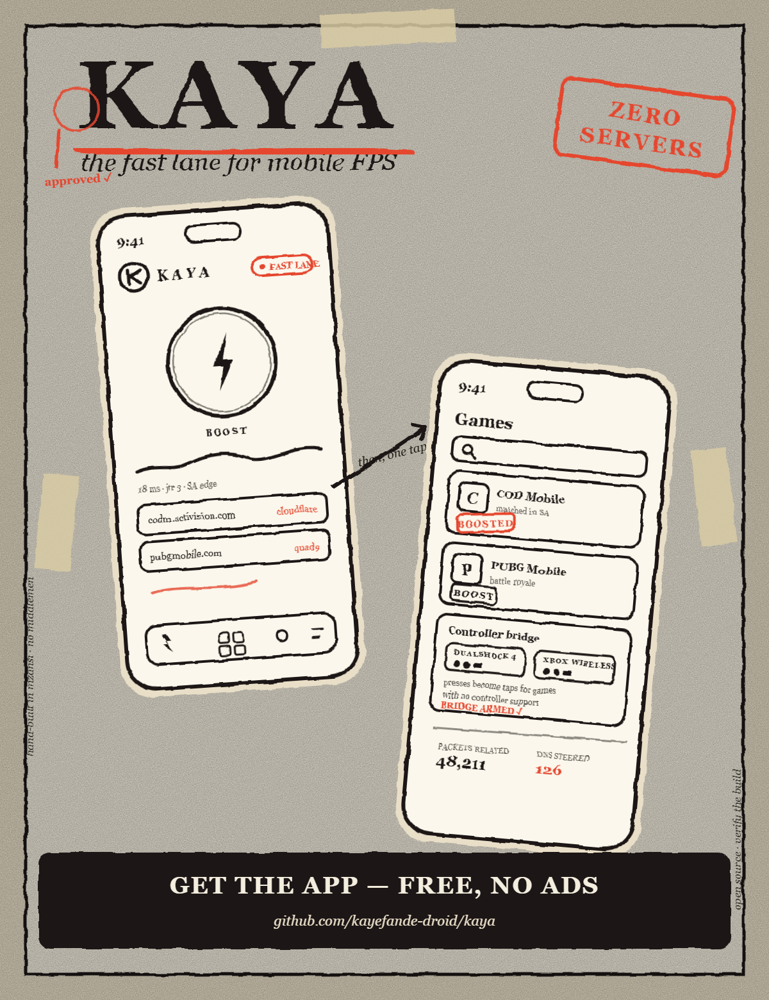

# Kaya — the fast lane for mobile FPS

<p align="center">
  
</p>

<p align="center">
  <em>drawn by hand, printed slightly off-register — like all good posters</em>
</p>

<p align="center">
  
</p>

> 🌍 **Website:** the landing page lives in [`site/`](site/index.html) and deploys on Render via the included `render.yaml` blueprint — see [Deploying the website](#deploying-the-website) below.
> 🔎 **Search:** the page ships with Google Search Console verification, Open Graph cards and `SoftwareApplication` structured data so Kaya shows its name, price (free), and download link directly in web search.

> ### 📲 Download & Install
> **[⬇️ Kaya-arm64.apk — recommended (small & fast)](https://github.com/kayefande-droid/kaya/releases/latest/download/Kaya-arm64.apk)** · [⬇️ Kaya.apk — universal](https://github.com/kayefande-droid/kaya/releases/latest/download/Kaya.apk)
>
> Direct from GitHub Releases — no ads, no accounts, no tracking. arm64 works on every phone sold since ~2016; the universal APK covers older 32-bit devices. SHA-256 checksums ship alongside each release (`SHA256SUMS.txt`).
>
> **Play Protect:** since Kaya installs outside the Play Store, Android may show an "unknown developer" prompt — tap **More details → Install anyway**. The APK is signed with Kaya's own release key.
>
> After installing: allow the **one-time VPN consent**, then set **Battery → Unrestricted** for Kaya (the Tuning screen walks you through it).

**Kaya** is a game booster & launcher for Android, built for mobile FPS players
(CODM, PUBG Mobile, Free Fire…) who want lower matchmaking latency — with
**zero servers, zero accounts, zero subscriptions**.

It is a **Flutter app with a hand-written native Android core**: a real
`VpnService`-based DNS steering engine, Wi-Fi low-latency locks, a background
traffic mitigator, and a controller→touch bridge. Everything runs **100% on
your device**.

---

## What Kaya actually does (no magic, no lies)

| Feature | How it works | Honest expectation |
|---|---|---|
| **Smart Anycast DNS engine** | A local `VpnService` intercepts DNS (port 53), races Cloudflare / Google / Quad9 from *your* device, and answers from the fastest edge. Game matchmaker domains (`*.activision.com`, `*.codm.com`, `*.demonware.net`, …) are steered aggressively. | ✅ Real effect: skips slow ISP resolver chains that hand off to Europe. |
| **Fast lane (UDP relay)** | Game UDP packets are re-emitted from a fresh, protected socket — bypassing per-app battery throttling on some OEMs. | ⚠️ Modest: helps when the OEM throttles background sockets; physics still wins. |
| **Boost locks** | `WIFI_MODE_FULL_LOW_LATENCY` WifiLock + CPU wake lock + battery-exemption guidance while a game is foreground. | ✅ Real effect on radios that power-save aggressively. |
| **Background mitigation** | Samples per-second background traffic and surfaces heavy sync apps in Tuning. | ✅ Awareness + OS deferral. |
| **Ping HUD & benchmark** | On-device TCP handshake timing + raw UDP DNS timing. No "ping boosters". | ✅ Honest numbers. |
| **Controller bridge** | Bluetooth HID pads (PS4 / Xbox / V8) are detected; the Accessibility service projects presses as taps for games without native pad support. | ✅ Works; per-game layouts are on the roadmap. |

> **What Kaya cannot do:** lower your ISP's peering quality, bypass the game
> server's region assignment by force, or add bandwidth. Anyone claiming more
> is selling a VPN with extra steps.

## The architecture in one look

```
┌──────────────────────────── Android app ────────────────────────────┐
│  Flutter UI (dark, hand-drawn)                                      │
│   Boost · Games · Network · Tuning                                  │
└──────────────┬──────────────────────────────────────────────────────┘
               │ MethodChannel "kaya/channel" + EventChannel "kaya/events"
┌──────────────┴──────────────────────────────────────────────────────┐
│  Native core (Kotlin, no third-party deps)                          │
│   KayaVpnService ─ TUN loop                                         │
│     ├─ DnsResponder → DnsRacer → Cloudflare/Google/Quad9 (raced)    │
│     ├─ UdpForwarder  → protected sockets → real destination         │
│     ├─ TcpProxy      → SYN-ACK terminator + upstream relay          │
│     └─ ICMP echo     → answered on-device (in-game ping stays sane) │
│   KayaBoostService ─ WifiLock(LL) + WakeLock + mitigator            │
│   KayaAccessibilityService ─ controller→tap projection              │
└─────────────────────────────────────────────────────────────────────┘
```

## Build it yourself

```bash
git clone <your-fork-url> kaya && cd kaya
flutter pub get
flutter build apk --release      # → build/app/outputs/flutter-apk/app-release.apk
```

Requirements: Flutter 3.22+, Android SDK 34, JDK 17. `minSdk 26` (Android 8.0+).

### Optional (recommended) one-time adb grants

```bash
# Pin Private DNS from the app's Network screen without root:
adb shell settings put global private_dns_mode hostname
adb shell settings put global private_dns_specifier one.one.one.one
```

## Permissions, and why

- **VPN consent** — the DNS engine is a local VpnService. Nothing leaves the device except the game's own traffic.
- **Battery exemption** — keeps the WifiLock/wake locks alive during a match.
- **Usage access** — background traffic sampling for the Tuning screen.
- **Accessibility** — only for the controller→touch bridge; window content is never read (`canRetrieveWindowContent=false`).
- **Nearby devices / Bluetooth** — gamepad detection.

## Deploying the website

The site is plain HTML/CSS (no build step) in `site/`, with a Render blueprint at the repo root.

1. **Deploy on Render:** dashboard → **New + → Blueprint** → pick `kayefande-droid/kaya` → Render reads `render.yaml` and publishes `site/` as a static site (e.g. `https://kaya-booster.onrender.com`).
2. **Google Search Console:** [search.google.com/search-console](https://search.google.com/search-console) → *Add property → URL prefix* → your Render URL → verification method **HTML tag** → copy the `content="..."` token and paste it over `REPLACE_WITH_YOUR_GSC_TOKEN` in `site/index.html` → commit & push → click **Verify** back in Search Console.
3. **Let the app appear in web search:** the page already includes:
   - `SoftwareApplication` JSON-LD (name, free price, download URL, screenshot) — this is what powers rich app results;
   - Open Graph + Twitter card tags so shared links render the flyer;
   - `robots.txt` + `sitemap.xml` pointing at the live URL.
   After verification, use Search Console's **URL Inspection → Request indexing** to speed up first inclusion.
4. If Render assigns a different domain, update the canonical URL, OG tags, sitemap URL and the JSON-LD `screenshot` link to match.

## Roadmap

- [ ] Per-game controller layout editor (drag pins over a screenshot)
- [ ] Jitter-aware "engine auto-pilot" (arms boost when a game launches)
- [ ] Home-screen widget + Quick-settings tile polish
- [ ] DNS-over-TLS upstream option

## License

MIT — see [LICENSE](LICENSE).
