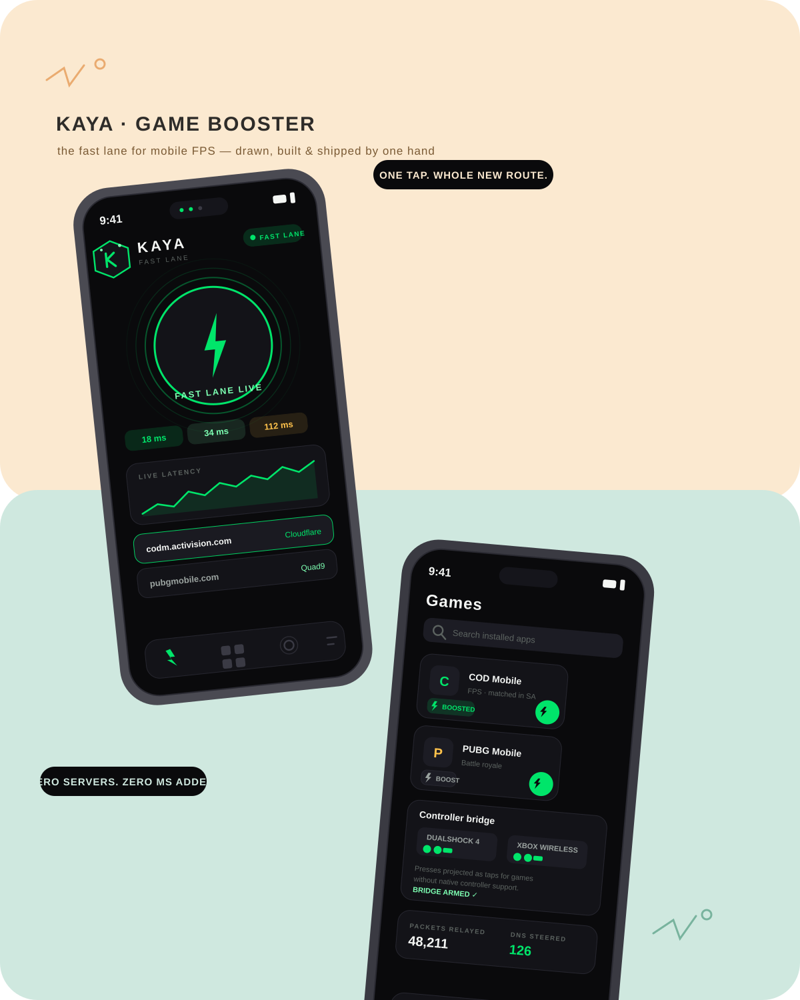

# Kaya ⚡ — the fast lane for mobile FPS

<p align="center">
  
</p>

> ### 📲 Download & Install
> **[⬇️ Download the latest Kaya APK](../../releases/latest/download/Kaya.apk)** — direct from GitHub Releases, no ads, no accounts, no tracking.
>
> After installing: allow the **one-time VPN consent**, then set **Battery → Unrestricted** for Kaya (the Tuning screen walks you through it).

**Kaya** is a game booster & launcher for Android, built for mobile FPS players
(CODM, PUBG Mobile, Free Fire…) who want lower matchmaking latency — with
**zero servers, zero accounts, zero subscriptions**.

It is a **Flutter app with a hand-written native Android core**: a real
`VpnService`-based DNS steering engine, Wi-Fi low-latency locks, a background
traffic mitigator, and a controller→touch bridge. Everything runs **100% on
your device**.

---

## What Kaya actually does (no magic, no lies)

| Feature | How it works | Honest expectation |
|---|---|---|
| **Smart Anycast DNS engine** | A local `VpnService` intercepts DNS (port 53), races Cloudflare / Google / Quad9 from *your* device, and answers from the fastest edge. Game matchmaker domains (`*.activision.com`, `*.codm.com`, `*.demonware.net`, …) are steered aggressively. | ✅ Real effect: skips slow ISP resolver chains that hand off to Europe. |
| **Fast lane (UDP relay)** | Game UDP packets are re-emitted from a fresh, protected socket — bypassing per-app battery throttling on some OEMs. | ⚠️ Modest: helps when the OEM throttles background sockets; physics still wins. |
| **Boost locks** | `WIFI_MODE_FULL_LOW_LATENCY` WifiLock + CPU wake lock + battery-exemption guidance while a game is foreground. | ✅ Real effect on radios that power-save aggressively. |
| **Background mitigation** | Samples per-second background traffic and surfaces heavy sync apps in Tuning. | ✅ Awareness + OS deferral. |
| **Ping HUD & benchmark** | On-device TCP handshake timing + raw UDP DNS timing. No "ping boosters". | ✅ Honest numbers. |
| **Controller bridge** | Bluetooth HID pads (PS4 / Xbox / V8) are detected; the Accessibility service projects presses as taps for games without native pad support. | ✅ Works; per-game layouts are on the roadmap. |

> **What Kaya cannot do:** lower your ISP's peering quality, bypass the game
> server's region assignment by force, or add bandwidth. Anyone claiming more
> is selling a VPN with extra steps.

## The architecture in one look

```
┌──────────────────────────── Android app ────────────────────────────┐
│  Flutter UI (dark, hand-drawn)                                      │
│   Boost · Games · Network · Tuning                                  │
└──────────────┬──────────────────────────────────────────────────────┘
               │ MethodChannel "kaya/channel" + EventChannel "kaya/events"
┌──────────────┴──────────────────────────────────────────────────────┐
│  Native core (Kotlin, no third-party deps)                          │
│   KayaVpnService ─ TUN loop                                         │
│     ├─ DnsResponder → DnsRacer → Cloudflare/Google/Quad9 (raced)    │
│     ├─ UdpForwarder  → protected sockets → real destination         │
│     ├─ TcpProxy      → SYN-ACK terminator + upstream relay          │
│     └─ ICMP echo     → answered on-device (in-game ping stays sane) │
│   KayaBoostService ─ WifiLock(LL) + WakeLock + mitigator            │
│   KayaAccessibilityService ─ controller→tap projection              │
└─────────────────────────────────────────────────────────────────────┘
```

## Build it yourself

```bash
git clone <your-fork-url> kaya && cd kaya
flutter pub get
flutter build apk --release      # → build/app/outputs/flutter-apk/app-release.apk
```

Requirements: Flutter 3.22+, Android SDK 34, JDK 17. `minSdk 26` (Android 8.0+).

### Optional (recommended) one-time adb grants

```bash
# Pin Private DNS from the app's Network screen without root:
adb shell settings put global private_dns_mode hostname
adb shell settings put global private_dns_specifier one.one.one.one
```

## Permissions, and why

- **VPN consent** — the DNS engine is a local VpnService. Nothing leaves the device except the game's own traffic.
- **Battery exemption** — keeps the WifiLock/wake locks alive during a match.
- **Usage access** — background traffic sampling for the Tuning screen.
- **Accessibility** — only for the controller→touch bridge; window content is never read (`canRetrieveWindowContent=false`).
- **Nearby devices / Bluetooth** — gamepad detection.

## Roadmap

- [ ] Per-game controller layout editor (drag pins over a screenshot)
- [ ] Jitter-aware "engine auto-pilot" (arms boost when a game launches)
- [ ] Home-screen widget + Quick-settings tile polish
- [ ] DNS-over-TLS upstream option

## License

MIT — see [LICENSE](LICENSE).
